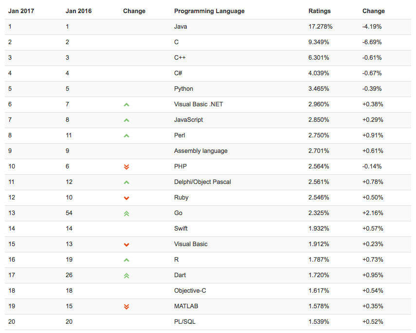

-
# Day12 - Software
-
###소프트웨어 공학
**소프트웨어 공학이란?**
> 유용한 사물이나 환경을 구축하는 목적으로 하는 학문
> 유용한 소프트웨어를 만드는 것을 목적으로 하는 학문   

**소프트웨어 개발 생명주기 모델**  
Software Development Life Cycle Model

* 주먹구구식?
* 폭포수
* 프로토타이핑
* 나선형

**소프트웨어 개발 방법론이란?**  
소프트웨어를 생산하는데 필요한 반복적인 과정들을 정리한 것

* Agile 애자일 개발 프로세스  
> 다른 고전적인 방법론과 구별되는 가장 큰 차이점은 Less Document-Oriented, 즉 문서를 통한 개발 방법이 아니라 Code-Oriented 실직적인 코딩을 통한 방법론.
앞을 예측하며 개발을 하지 않고, 일정한 주기를 가지고 끊임없이 프로토 타입을 만들어내며 그때 그떄 필요한 요구를 더하고 수정하여 하나의 커다란 소프트웨어를 개발해 나가는 Adaptive Style (좋은것을 빠르게 낭비없게 만드는것

* UML (Unified Modeling Language)
> 통합모델링 언어  
> 표준화된 범용 모델링 언어  
> 객체 지향 소프트웨어 집약시스템을 개발할 때 산출물을 명세화,시각화,문서화할때 사용  

* TDD (Test-Driven Development)
>매우 짧은 개발 사이클을 반복하는 소프트웨어 개발 방법론
>결함을 점검하는 자동화된 테스트 케이스를 작성
>케이스를 통과하기 위해 최소한의 양의 코드를 생성
>새 코드를 표준에 맞도록 리팩토링
>

* PDD (Plan-Driven Development) 
> 계획 기반 개발
> 계획을 세우고 그 계획을 실천하는데에 많은 시간과 노력을 할애하는 개발 방법
> 

* 형상관리
> SW개발 미치 유지보수 과정에서 발생하는 소스코드, 문서, 인터페이스 등 각종 결과물에 대해 형상을 만들고, 이들 형상에 대한 변경을 체계적으로 관리, 제어하기 위한 활동
 
* 버전관리
>형상관리의 일부

-
	
###프로그래밍 언어  
  

고급언어에서 저급언어로 변환되는 과정에 따른 분류  
  
* 컴파일 언어
> C, C++, Go...
> 실행속도가 빠르다 컴파일하는데 시간이 좀 걸린다
> 코드에 하나 수정해도 모두 컴파일 해야합니다.
> 생산성이 떨어진다.
> 컴파일되서 전달되기 때문에 원본 소스의 노출이 없다.

* 인터프리터 언어
> Basic, JavaScript, Python, Ruby...  
> 코드자체를 인터프리터가 실시간으로 번역해서 전달
> 위기 대처에 강하다/부분 버그를 바로 수정할수 있다.
 
* 바이트코드 언어
> Java, C# ... (검색해서 찾어봐)

* 프로그래밍 패러다임  
* 객채지향 프로그래밍 패러다임  
* 함수형 프로그래밍 패러다임  

-

###객체지향 프로그래밍 패러다임
* 객체지향 프로그래밍 패러다임
> Objective-C, Python,, Swift, C++, C#, Smalltalk, Perl, Ruby, Jav..

* 함수형 프로그래밍 패러다임
>프로그램의 상태값을 지니지 않는 함수값들의 연속으로 표현

-

###프로그래밍 용어
Software Developer
Server / Client
Front-end / Back-end
Thread (앞에 님에게 물어봐)

**프레임워크** - 국가(정부)  
**프레임워크의 하위 프레임워크** - 정부부처  
**API** - 국가기관   
**라이브러리** - 직무 전문가  
**프로그래밍 언어** - 국가 통용 언어  
**레퍼런스 문서** - 국가 조직도 및 기능 설명서  

**디자인패턴**

* MVC ( Model-View-Controller)
* MVVM (Model-View-ViewModel)
* Observer
* Singleton
* Prototype

**IDE** Intergrated Development Environment  
통합 개발 환경
**SDK** Software Development Kit  
소프트웨어 개발에 필요한 도구의 모음  
IDE + Framework + Tools

### 과제
>HTML5이 탄생하게 된 배경
>기존 HTML을 사용하는 것보디 이로운 점
>국내외의 HTML5

Source: